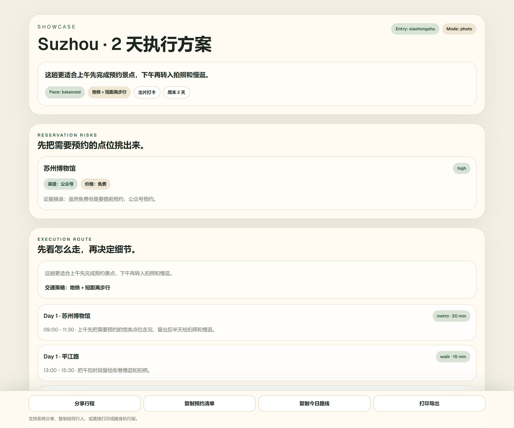
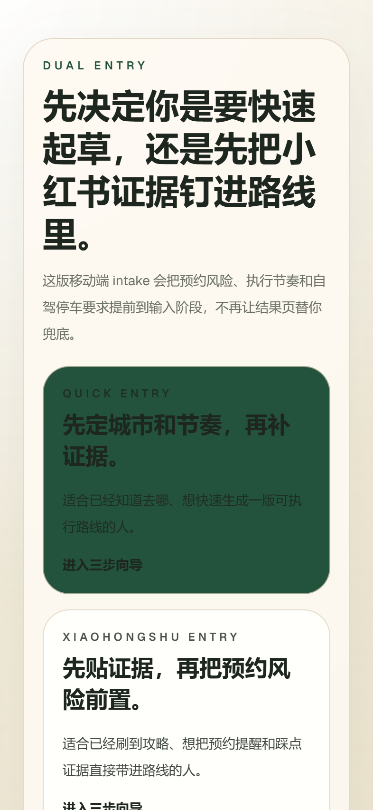
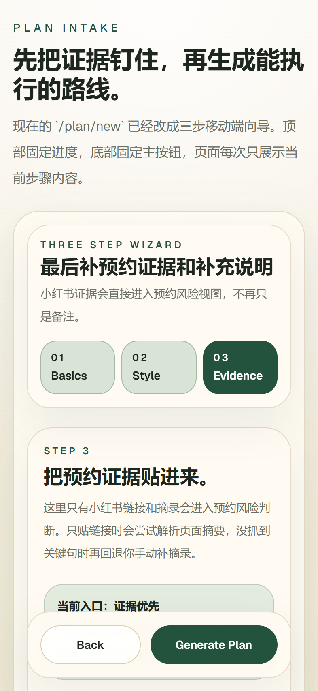
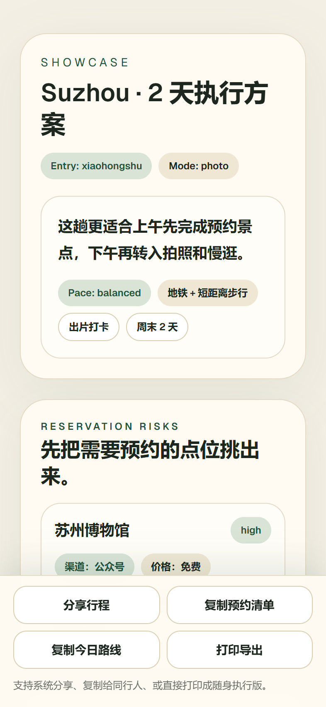
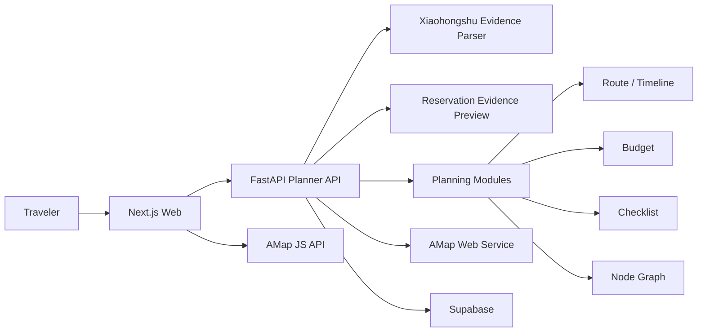

# Visitors

China-first AI travel planner for executable city trips.
面向中国境内城市旅行的执行型智能行程规划器。

[中文](#中文) | [English](#english)

`Visitors` is built for weekend and holiday trips in China. It turns scattered travel notes, reservation hints, map distance, weather, budget, parking, and hotel-area decisions into one result page that a traveler can actually follow.

The product is intentionally narrow and deep: it does not try to be a generic travel chatbot. It focuses on reservation reliability, executable routing, and controllable itinerary editing.

## Product Preview

Screenshots below are captured from the current local production preview.

<p align="center">
  
</p>

<p align="center">
  
  
  
</p>

## 中文

### 项目定位

`Visitors` 是一个面向作品集展示和开源发布的国内旅行智能规划项目。它解决的不是“推荐几个景点”，而是把用户出发前真正会纠结的信息整理成可执行方案：

- 哪些景点需要提前预约
- 预约渠道、价格和证据是什么
- 每天按什么顺序走更顺
- 门票、餐饮、住宿、交通大概花多少钱
- 自驾是否好停车，停车场怎么选
- 天气、证件、穿搭和行前准备是否遗漏
- 生成后能不能继续调整，而不是只能接受一次性答案

苏州只是录屏和讲解样例，不是产品边界。真实使用时，用户可以输入任意国内城市，再根据天数、预算、交通方式、兴趣偏好和小红书证据生成方案。

### 核心差异化

#### 1. 预约可靠性优先

很多旅行生成器会写一句“建议提前预约”，但不会说明具体是哪个景点、去哪里预约、价格如何、证据来自哪里。`Visitors` 把预约提醒做成结构化信息，并在输入阶段提前预览，避免结果页看起来很完整但真正出发时才发现关键景点约不上。

#### 2. 可执行路线优先

结果页不是一段长攻略，而是面向行动的出行指挥板：小时级时间轴、路线摘要、地图点位、交通时长、预算明细、停车建议、酒店片区和行前清单会放在同一个上下文里。

#### 3. 可控的智能规划

生成方案后，用户可以锁定必去点、移除不想去的点，并重新优化剩余路线。这个交互让产品从“智能给一个答案”变成“用户带着约束继续调方案”，更接近真实旅行决策。

### 当前已实现

- 双入口首页：快速规划入口、小红书证据优先入口
- 三步移动端输入流程：基础信息、旅行风格、证据预览
- `POST /plans/evidence-preview`：提交前解析预约证据
- `POST /plans` 与 `GET /plans/{id}`：方案生成闭环
- Supabase 持久化，未配置时可降级到本地内存模式
- 高德地图点位渲染与天气相关准备提示
- 结果页包含预约风险、执行路线、时间轴、地图、预算、清单、节点关系图、停车和酒店片区
- 行程编辑台：锁定站点、移除站点、重新优化可调整路线
- 分享页和展示页，方便录制作品集视频
- 中文 / English 页面切换与明亮 / 暗色主题切换

### 推荐演示路径

1. 打开 `/`，展示双入口首页。
2. 打开 `/plan/new?entry=quick`，展示常规三步规划流程。
3. 打开 `/plan/new?entry=xiaohongshu`，展示预约证据预览。
4. 打开 `/showcase?lang=zh-CN&theme=dark`，展示稳定结果页。
5. 在结果页锁定一个预约景点，移除一个非必去点，再重新优化剩余路线。
6. 打开 `/showcase/share`，展示适合录屏和对外分享的版本。

### 技术架构



### 技术栈

- Frontend: `Next.js`
- Backend: `FastAPI`
- Database / Storage: `Supabase`
- Map / Geo / Weather: `AMap`
- Version Control: `Git + GitHub`

### 仓库结构

```text
visitors/
  api/          FastAPI planner API
  web/          Next.js frontend
  supabase/     schema, migrations, policies
  docs/         product and portfolio docs
    VISITORS_PRD.md       主产品需求文档（中文）
    VISITORS_PRD.en.md    英文版 PRD
    portfolio-case.md     面试讲述材料
    archive/              历史草案
  reference/    downloaded reference projects
  README.md
```

### 本地运行

#### 后端

```bash
cd api
python -m venv .venv
.venv\Scripts\activate
pip install -r requirements.txt
uvicorn app.main:app --reload
```

#### 前端

```bash
cd web
npm install
npm run dev
```

#### 常用页面

- `http://localhost:3000/`
- `http://localhost:3000/plan/new?entry=quick`
- `http://localhost:3000/plan/new?entry=xiaohongshu`
- `http://localhost:3000/showcase`
- `http://localhost:3000/showcase/share`

### 环境变量

后端 `api/.env`

| Key | 说明 |
| --- | --- |
| `APP_ENV` | 运行环境 |
| `SUPABASE_URL` | Supabase 项目地址 |
| `SUPABASE_ANON_KEY` | Supabase 匿名 key |
| `SUPABASE_SERVICE_ROLE_KEY` | Supabase service role key，用于持久化 |
| `AMAP_WEB_SERVICE_KEY` | 高德 Web Service key |
| `XIAOHONGSHU_PARSER_MODE` | 小红书解析模式，默认 `best_effort` |

前端 `web/.env.local`

| Key | 说明 |
| --- | --- |
| `NEXT_PUBLIC_API_BASE_URL` | 后端 API 地址 |
| `NEXT_PUBLIC_SUPABASE_URL` | Supabase 项目地址 |
| `NEXT_PUBLIC_SUPABASE_ANON_KEY` | Supabase 匿名 key |
| `NEXT_PUBLIC_AMAP_JS_KEY` | 高德 JS API key |
| `NEXT_PUBLIC_AMAP_SECURITY_JS_CODE` | 高德安全码 |

开源使用建议：

- 不要把个人 API key 提交到 GitHub。
- 使用者需要复制 `.env.example`，再填写自己的 Supabase 和高德 key。
- 如果只想看界面，可以先打开 `/showcase`，不需要接完所有外部服务。

### 作品集看点

这个项目适合在产品经理面试中讲三层能力：

- 产品判断：没有做泛旅行助手，而是聚焦国内旅行的预约、路线和执行风险。
- 交互设计：把一次性生成改成可预览、可编辑、可分享的流程。
- 工程落地：前端、后端、持久化、地图、预算、证据解析和展示页形成闭环。

产品文档见 [docs/VISITORS_PRD.md](docs/VISITORS_PRD.md)（中文主文档）与 [docs/VISITORS_PRD.en.md](docs/VISITORS_PRD.en.md)。
更完整的面试讲述材料见 [docs/portfolio-case.md](docs/portfolio-case.md)。

### 当前状态

这个仓库目前是一个可运行、可演示、可继续开源演进的 V1 原型。它还不是成熟旅游平台，但已经能展示完整的产品判断和核心链路。

### 运行成本：免费（不产生费用）

| 项 | 成本 | 说明 |
| --- | --- | --- |
| 核心规划 / 结果页 / 导出 | **免费** | 本地运行，无付费 API |
| AI 规划引擎 | 本地规则 + 可选本地模型 | 不依赖付费云模型 |
| 高德地图（点位/天气提示） | 个人开发者**免费 key** | 免费注册即可（有个人免费配额） |
| Supabase（持久化） | **免费档**足够；未配置时**自动降级本地内存** | 持久化可选，不影响核心演示 |
| 小红书证据解析 | best-effort 本地解析 | 只读取链接公开内容，不调付费服务 |

> 一句话给面试官：**核心规划与演示在本机零成本跑通**；地图与持久化用到的外部服务（高德/Supabase）均有个人免费档，key 免费注册即可，不产生订阅费用。

下一步更值得补的是：

- 清理全站残留文案，保证中英文完全一致
- 接入更真实的路线距离和预约窗口约束
- 把当前前端行程优化演示升级成后端可解释优化器
- 增加多人共创和旅行后内容生成

## English

### Positioning

`Visitors` is an open-source AI travel planner for domestic China city trips. It is designed as a portfolio-grade product case, not just a UI demo.

The product does not try to compete on generic travel inspiration. It focuses on a more practical job: turning scattered trip information into a plan that a traveler can trust and execute.

Suzhou is only the demo preset used for walkthroughs and screen recordings. The real flow starts from any domestic China city entered by the user.

### What Makes It Different

#### 1. Reservation reliability first

Many itinerary generators mention reservations as a vague reminder. `Visitors` treats reservation risk as a first-class planning object: which attraction needs attention, where to book, whether it is free or paid, and what evidence triggered the alert.

#### 2. Execution-first routing

The result page is not a long generated article. It is a command board with hour-level timeline, route summary, map points, transit duration, budget, packing checklist, parking guidance, and hotel-area suggestions.

#### 3. Controllable AI planning

After generation, users can lock must-go stops, remove unwanted stops, and re-optimize only the flexible route. This turns the product from "AI gives one answer" into "the user steers the answer with constraints."

### Implemented Features

- Dual-entry homepage for quick planning and Xiaohongshu evidence-first planning
- Mobile-first three-step intake wizard
- `POST /plans/evidence-preview` for reservation evidence preview
- `POST /plans` and `GET /plans/{id}` for the generation loop
- Supabase persistence with local in-memory fallback
- AMap route/map rendering and weather-aware preparation hints
- Result page with reservation risk, route summary, timeline, map, budget, checklist, graph, parking, and hotel-area panels
- Editable itinerary controls for locking, removing, and re-optimizing route stops
- Showcase and share pages for portfolio demos
- Chinese / English UI switching and light / dark theme switching

### Recommended Demo Flow

1. Open `/` to show the dual-entry start screen.
2. Open `/plan/new?entry=quick` to show the normal planning flow.
3. Open `/plan/new?entry=xiaohongshu` to show evidence-first reservation parsing.
4. Open `/showcase?lang=en&theme=dark` or `/showcase?lang=zh-CN&theme=dark` for the stable result page.
5. Lock a reservation-sensitive stop, remove a flexible stop, and re-optimize the route.
6. Open `/showcase/share` for a recording-friendly presentation view.

### Architecture


### Tech Stack

- Frontend: `Next.js`
- Backend: `FastAPI`
- Database / Storage: `Supabase`
- Map / Geo / Weather: `AMap`
- Version Control: `Git + GitHub`

### Local Development

Run the backend:

```bash
cd api
python -m venv .venv
.venv\Scripts\activate
pip install -r requirements.txt
uvicorn app.main:app --reload
```

Run the frontend:

```bash
cd web
npm install
npm run dev
```

Useful routes:

- `http://localhost:3000/`
- `http://localhost:3000/plan/new?entry=quick`
- `http://localhost:3000/plan/new?entry=xiaohongshu`
- `http://localhost:3000/showcase`
- `http://localhost:3000/showcase/share`

### Environment Variables

Backend `api/.env`

| Key | Description |
| --- | --- |
| `APP_ENV` | Runtime environment |
| `SUPABASE_URL` | Supabase project URL |
| `SUPABASE_ANON_KEY` | Supabase anon key |
| `SUPABASE_SERVICE_ROLE_KEY` | Supabase service role key for persistence |
| `AMAP_WEB_SERVICE_KEY` | AMap Web Service key |
| `XIAOHONGSHU_PARSER_MODE` | Xiaohongshu parser mode, default `best_effort` |

Frontend `web/.env.local`

| Key | Description |
| --- | --- |
| `NEXT_PUBLIC_API_BASE_URL` | Backend API base URL |
| `NEXT_PUBLIC_SUPABASE_URL` | Supabase project URL |
| `NEXT_PUBLIC_SUPABASE_ANON_KEY` | Supabase anon key |
| `NEXT_PUBLIC_AMAP_JS_KEY` | AMap JS API key |
| `NEXT_PUBLIC_AMAP_SECURITY_JS_CODE` | AMap security code |

Open-source usage notes:

- Do not commit personal API keys to GitHub.
- Users should copy `.env.example` and fill in their own Supabase and AMap keys.
- If you only want to inspect the UI, open `/showcase` first.

### Portfolio Angle

This project is best evaluated as an AI product case:

- Product judgment: it focuses on real domestic travel execution risks instead of broad inspiration.
- Interaction design: it supports preview, editing, sharing, and presentation instead of one-shot generation.
- Engineering delivery: frontend, backend, persistence, map context, evidence parsing, budget, and result presentation form a working loop.

See [docs/portfolio-case.md](docs/portfolio-case.md) for the interview narrative.

### Current Status

This repository is a runnable V1 prototype for portfolio and open-source use. It is not a mature travel platform yet, but it already demonstrates the core product logic and implementation loop.

High-value next steps:

- Normalize remaining UI copy across Chinese and English
- Use real route distance and reservation-window constraints
- Upgrade the current frontend optimization demo into an explainable backend route optimizer
- Add co-planning and post-trip content generation
