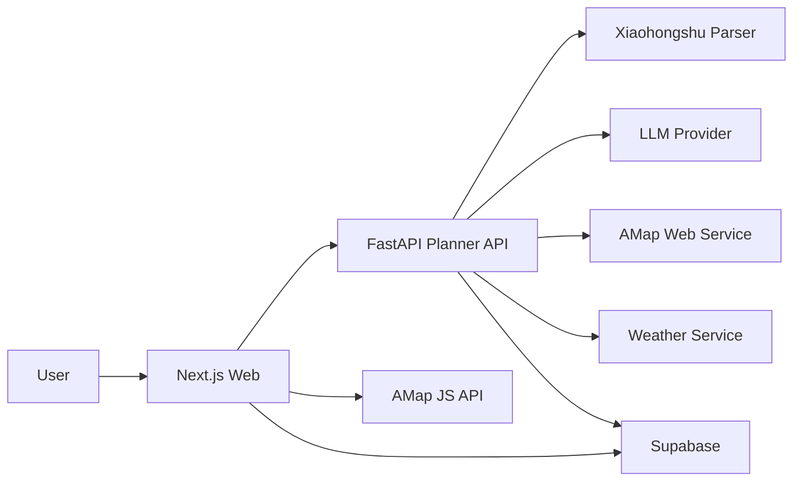

# Visitors

AI travel planner for China-first city trips.

Visitors helps users who do not have time to research a trip generate a detailed, executable travel plan with:

- dual mobile entry for quick start and Xiaohongshu-evidence-first intake
- three-step wizard intake tuned for mobile screens
- hour-level itinerary
- interactive city planning map
- reservation reminders
- execution-first result screen with reservation risks and route summary
- precise budget breakdown
- self-drive parking guides and hotel area suggestions
- packing and weather checklist
- Xiaohongshu link parsing
- bilingual output in Chinese and English
- multi-agent planning workflow
- graph view of itinerary relationships

---

## What It Solves

Travel information is scattered across Xiaohongshu, maps, weather apps, ticketing pages, hotel platforms, and random note-taking tools. For users who want to be well-prepared but do not want to spend hours building an itinerary by hand, this creates three problems:

- too much fragmented information
- no clear hour-by-hour executable plan
- easy to miss ticketing, reservation, weather, and packing details

Visitors turns those scattered inputs into one structured travel result page.

## Target Users

- users planning a domestic China city trip
- people who want to be fully prepared before traveling
- users who care about budget, transport, and timing
- users who want photo-friendly spots, vlog-friendly routes, or quiet/nature-focused plans
- couples, friends, and future co-planning travel buddies

## Core Features

### 1. Dual-Entry Mobile Intake

Users can input:

- destination city, travel days, and budget range
- transport preference and self-drive parking sort
- accommodation style, travel mode, and preference tags
- special requirements
- Xiaohongshu link and evidence notes

The intake flow now supports:

- `quick` entry for users who want to sketch the route first
- `xiaohongshu` entry for users who want to pin reservation evidence first
- a fixed three-step mobile wizard:
  - Basics
  - Style
  - Evidence

### 2. Hour-Level Itinerary

The system generates a detailed day-by-day plan with:

- start and end time for each stop
- transit method and estimated duration
- attraction notes
- meal suggestions
- alternative plan hints

### 3. Execution-First Result Screen

The result page now starts with:

- execution summary
- reservation risk panel
- execution route preview

These appear before the map, full timeline, budget panel, checklist, and graph view.

### 4. City Planning Map

The result includes a scaled city travel map based on real location data:

- itinerary route by day
- hotel area suggestion
- major attraction points
- transport links
- relative distance awareness

### 5. Reservation Reminder on Itinerary Cards

Each itinerary card can show reservation-related metadata when available:

- reservation required or not
- reservation reminder text
- reservation channel
- ticket price or free entry note
- source evidence

V1 rule:

- reservation reminders are extracted only from Xiaohongshu content when the note explicitly mentions advance reservation
- examples include cases like Suzhou Museum being free but still requiring early reservation
- final UI must remind users to verify official channels

### 6. Self-Drive Parking and Hotel Area Suggestions

When the plan is self-drive oriented and `parking_required = true`, Visitors can surface:

- parking guides ranked by distance or parking price
- walking-time expectations from the recommended lot
- area-level hotel suggestions tuned for self-drive convenience

When the plan is not self-drive oriented, parking panels stay hidden.

### 7. Precise Budget Breakdown Panel

Visitors includes a multi-dimensional budget panel with:

- attraction tickets
- food
- accommodation
- intercity transport
- local transport
- optional shopping / flexible budget

### 8. Packing and Preparation Checklist

The checklist is generated from city, season, weather, and trip style, including:

- ID card / student card / required documents
- umbrella / sunscreen / light jacket
- power bank / chargers / camera gear
- makeup / toiletries / medication

### 9. Chinese and English Output

The product is designed to support:

- Chinese UI and output
- English UI and output
- bilingual itinerary content in future expanded versions

### 10. Multi-Agent Planning

The planning pipeline is designed around specialized agents, such as:

- intake agent
- city research agent
- routing agent
- budget agent
- checklist agent
- reservation hint agent
- review agent

### 11. Itinerary Graph View

Generated itinerary data can be converted into a node relationship graph to visualize:

- city
- day blocks
- attractions
- hotel area
- budget categories
- reservation dependencies

This helps users understand trip structure, not just a long block of text.

---

## Product Principles

- China-first, not global-first
- execution quality over generic inspiration
- structured output over raw AI text
- practical details over vague recommendations
- solo-friendly architecture and fast iteration

## Tech Stack

- Frontend: `Next.js`
- Backend: `FastAPI`
- Database / Auth / Storage: `Supabase`
- Map: `AMap / 高德地图`
- Version control: `Git + GitHub`

## Planned Architecture



## Planned Result Page

The V1 result page is expected to include:

- execution summary
- reservation risk panel
- execution route preview
- city planning map
- day-by-day hour-level timeline
- itinerary cards
- reservation reminder area
- parking guide panel
- hotel area recommendation
- budget breakdown panel
- weather and outfit hints
- packing checklist
- graph view of trip relationships

## Repository Direction

This project is intended to become open source.

Planned repository structure:

```text
visitors/
  web/
  api/
  supabase/
  docs/
  README.md
  PRD.md
```

## Local Visual Preview

If you want to inspect the frontend visually instead of only reading TSX in VSCode:

1. Run `npm run dev` inside `web/`
2. Open `http://localhost:3000/` to verify the dual-entry homepage
3. Open `http://localhost:3000/plan/new?entry=quick` to review the quick-entry wizard
4. Open `http://localhost:3000/plan/new?entry=xiaohongshu` to review the evidence-first wizard
5. Open `http://localhost:3000/showcase` to review the execution-first result layout
6. Use `showcase` as the stable preview for reservation risks, execution route, parking panels, timeline, budget panel, checklist, and graph sections
7. Add `NEXT_PUBLIC_AMAP_JS_KEY` in `web/.env.local` if you want the real AMap route instead of the fallback panel

## Roadmap

### V1

- single-city domestic travel planning
- hour-level itinerary
- city planning map
- reservation reminders from Xiaohongshu evidence
- budget breakdown
- packing checklist
- Chinese / English support

### V1.5

- editable itinerary
- shared planning with travel buddies
- saved plans
- better export and share flows

### V2

- multi-city planning
- stronger collaboration
- post-trip content generation
- photo-to-caption workflow for social sharing

## Open Source Status

Current status:

- product scope and PRD are defined
- Next.js frontend scaffold is running with a showcase result page
- FastAPI planner API scaffold is connected to the intake flow
- Supabase schema drafts are prepared for the next persistence step

Open source goals:

- readable product structure
- modular AI planning pipeline
- practical China travel planning workflow

## Notes

- Reservation reminders in V1 are evidence-based, not official truth.
- Users should always verify official reservation channels, prices, and policies.
- China map and itinerary quality are more important than generic global travel support.
