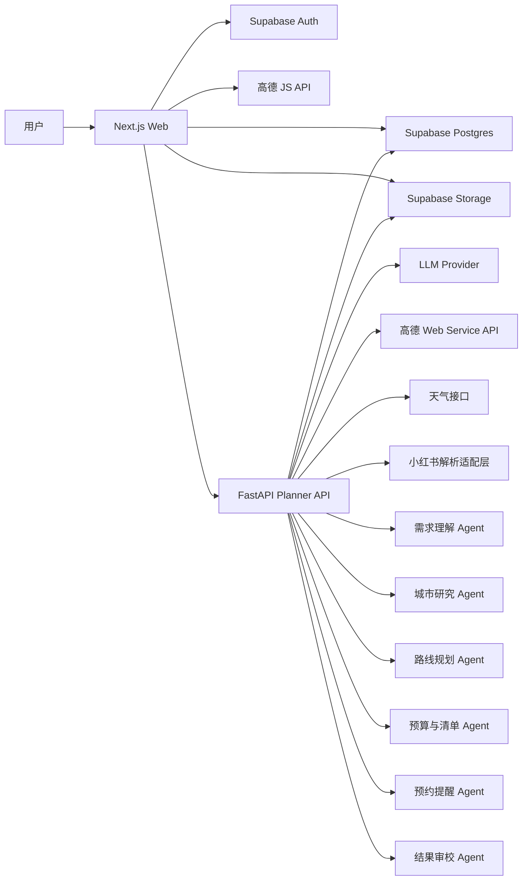
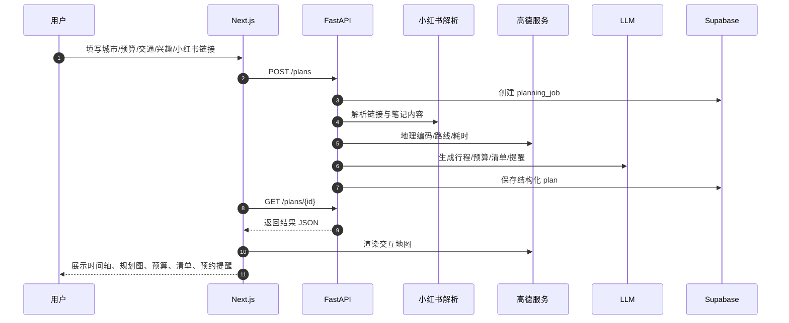

# 国内旅行 AI 规划产品 V1 实施计划

> **给 Claude：** 必须使用 `superpowers:executing-plans` 子技能，按任务逐项执行本计划。

**目标：** 基于 `Next.js + FastAPI + Supabase + 高德地图` 构建一个国内旅行 AI 工具，支持输入旅行需求后生成小时级攻略、城市规划图、预算与准备清单，并支持从小红书内容中识别“需提前预约”的景点提醒。

**架构方案：** 采用单仓库双应用结构：`web/` 负责产品前台、交互地图、结果页与分享；`api/` 负责 AI 编排、内容解析、路线规划、预算与清单生成；`Supabase` 负责鉴权、数据库与存储；`高德地图` 在前端负责交互展示，在后端负责地理编码与路线计算。V1 中“景点预约提醒”只基于小红书解析结果生成，不直接把它视为官方事实。

**技术栈：** Next.js、TypeScript、Tailwind CSS、shadcn/ui、FastAPI、Python、Supabase、PostgreSQL、AMap JS API、AMap Web Service API、Git、GitHub Actions

---

## 架构图

### 总体架构



### 生成链路



## 架构约束

### 1. 仓库结构

V1 采用单仓库，避免 solo 维护多个仓库的同步成本。

```text
visitors/
  web/                    # Next.js
  api/                    # FastAPI
  supabase/               # migration / seed / policies
  docs/plans/             # 计划文档
  .github/workflows/      # CI
  README.md
  .gitignore
```

### 2. 前后端职责边界

- `web/` 只负责 UI、表单、结果渲染、交互地图、分享导出
- `api/` 负责 AI 编排、结构化生成、地理与天气聚合、小红书解析
- `Supabase` 负责用户、计划、结果、历史、附件元数据
- 不把复杂 AI 逻辑塞进 Next.js Route Handlers

### 3. 地图双通道规则

- 前端：高德 JS API，用于交互地图和可视化
- 后端：高德 Web Service API，用于地理编码、路线时长、距离计算、行政区域信息

### 4. 预约提醒规则，V1 强约束

景点预约提醒 **只来自小红书解析结果**，不从模型臆测生成。

必须满足以下条件之一才显示提醒：

- 笔记正文明确出现“预约”
- 明确出现“提前预约”
- 明确出现“放票”
- 明确出现“实名预约”
- 明确出现“公众号预约”或“官方小程序预约”
- 明确出现“免费但是要预约”或等价表达

例如：

- “苏州博物馆虽然免费，但是要提前很久预约”
- “故宫要提前抢票”
- “陕西历史博物馆记得实名预约”

V1 不做的事：

- 不把“可能需要预约”当成事实
- 不根据常识强行补预约结论
- 不承诺提醒内容是官方最新规则

前台展示文案必须明确：

- “以下预约提醒来自小红书笔记提取，请以官方渠道为准”

### 5. Git 与 GitHub 规则

- 单仓库 Git 管理
- 远端托管 GitHub
- 分支规范：
  - `main`
  - `feat/<topic>`
  - `fix/<topic>`
- 每个任务最少一个清晰提交
- 关键里程碑打 tag，例如 `v0.1.0-mvp`
- 所有推送走 GitHub Actions 基础检查

## 数据模型，V1 最小集合

### `users`

- `id`
- `email`
- `created_at`

### `plans`

- `id`
- `user_id`
- `city`
- `days`
- `budget_min`
- `budget_max`
- `transport_preferences`
- `stay_preferences`
- `interest_tags`
- `special_requirements`
- `status`
- `created_at`

### `plan_sources`

- `id`
- `plan_id`
- `source_type`，如 `xhs_link`
- `source_url`
- `source_title`
- `raw_content`

### `plan_itineraries`

- `id`
- `plan_id`
- `day_index`
- `start_time`
- `end_time`
- `poi_name`
- `transport_mode`
- `transport_duration_minutes`
- `notes`

### `plan_map_points`

- `id`
- `plan_id`
- `name`
- `lat`
- `lng`
- `day_index`
- `sequence_no`

### `plan_budget_items`

- `id`
- `plan_id`
- `category`
- `amount_low`
- `amount_high`
- `is_adjustable`

### `plan_checklist_items`

- `id`
- `plan_id`
- `category`
- `item_name`
- `reason`

### `plan_reservation_hints`

- `id`
- `plan_id`
- `poi_name`
- `hint_text`
- `source_url`
- `source_type`
- `confidence`
- `evidence_excerpt`

## 建议目录结构

### `web/`

```text
web/
  app/
    page.tsx
    plan/
      new/page.tsx
      [planId]/page.tsx
  components/
    intake/
    result/
    map/
  lib/
    api.ts
    supabase.ts
    schemas.ts
  styles/
  tests/
```

### `api/`

```text
api/
  app/
    main.py
    core/
      config.py
    routers/
      health.py
      plans.py
    services/
      planner.py
      amap_service.py
      weather_service.py
      xhs_service.py
      reservation_hint_service.py
    agents/
      intake_agent.py
      city_research_agent.py
      routing_agent.py
      budget_agent.py
      checklist_agent.py
      reservation_agent.py
      review_agent.py
    schemas/
      plan.py
      result.py
    tests/
```

### `supabase/`

```text
supabase/
  migrations/
  seed.sql
  policies.sql
```

## 开发顺序

优先顺序不是“先把所有功能都搭好”，而是按最短可验证路径推进。

### 阶段 0：仓库与基础规范

目标：先把 Git、目录、CI、环境变量管理定住。

### 阶段 1：前端输入页与结果页骨架

目标：先让用户能输入，再看到一个稳定的结果页容器。

### 阶段 2：FastAPI 与 Supabase 打通

目标：先打通“提交需求 -> 保存任务 -> 拉回结果”的闭环。

### 阶段 3：路线规划最小链路

目标：先做小时级 itinerary 和地图点位，不急着把预算、清单一次做满。

### 阶段 4：小红书解析与预约提醒

目标：先把最有差异化的“从小红书提取预约提醒”跑通。

### 阶段 5：预算、清单、天气

目标：补足 J 人真正关心的准备充分度。

### 阶段 6：分享与导出

目标：让结果能传播、能截图、能保存。

### 阶段 7：稳定性与发布

目标：可部署、可回归、可继续迭代。

## 任务拆解

### 任务 1：初始化仓库与 GitHub 基础

**涉及文件：**
- 新建：`.gitignore`
- 新建：`README.md`
- 新建：`.github/workflows/ci.yml`
- 新建：`web/`
- 新建：`api/`
- 新建：`supabase/`

**步骤 1：初始化本地仓库**

运行：

```bash
git init
git branch -M main
```

预期：当前目录可执行 `git status`

**步骤 2：创建 GitHub 远端仓库并绑定**

运行：

```bash
git remote add origin <your-github-repo-url>
```

预期：`git remote -v` 能看到 `origin`

**步骤 3：补齐根目录基础文件**

至少包括：

- Node / Python / env / build 产物忽略规则
- README 中的启动说明占位
- GitHub Actions 占位流程

**步骤 4：提交第一次基线**

```bash
git add .
git commit -m "chore: initialize repository baseline"
git push -u origin main
```

### 任务 2：搭建 Next.js 前端骨架

**涉及文件：**
- 新建：`web/package.json`
- 新建：`web/app/page.tsx`
- 新建：`web/app/plan/new/page.tsx`
- 新建：`web/app/plan/[planId]/page.tsx`
- 新建：`web/components/intake/`
- 新建：`web/components/result/`
- 测试：`web/tests/`

**步骤 1：初始化 Next.js**

运行：

```bash
npx create-next-app@latest web --ts --eslint --app --tailwind --src-dir false --import-alias "@/*"
```

预期：`web/` 可启动开发环境

**步骤 2：先写一个最小页面测试**

验证目标：

- 首页能打开
- `/plan/new` 能渲染输入表单占位
- `/plan/[planId]` 能渲染结果页占位

**步骤 3：实现最小页面骨架**

包括：

- 首页 CTA
- 需求输入页
- 结果页布局占位：地图区、时间轴区、预算区、清单区、预约提醒区

**步骤 4：运行前端校验**

```bash
cd web
npm run lint
```

预期：通过

**步骤 5：提交变更**

```bash
git add web
git commit -m "feat: scaffold nextjs web shell"
```

### 任务 3：搭建 FastAPI 骨架

**涉及文件：**
- 新建：`api/requirements.txt`
- 新建：`api/app/main.py`
- 新建：`api/app/routers/health.py`
- 新建：`api/app/routers/plans.py`
- 新建：`api/app/tests/test_health.py`

**步骤 1：创建 Python 虚拟环境**

运行：

```bash
cd api
python -m venv .venv
```

**步骤 2：安装基础依赖**

建议依赖：

- `fastapi`
- `uvicorn`
- `pydantic`
- `httpx`
- `pytest`

**步骤 3：先写健康检查测试**

测试目标：

- `GET /health` 返回 `200`
- 返回体包含 `ok`

**步骤 4：实现 FastAPI 最小服务**

至少包括：

- `main.py`
- `health router`
- `plans router` 占位

**步骤 5：运行测试**

```bash
cd api
pytest -q
```

预期：通过

**步骤 6：提交变更**

```bash
git add api
git commit -m "feat: scaffold fastapi service"
```

### 任务 4：Supabase 项目与最小表结构

**涉及文件：**
- 新建：`supabase/migrations/001_init.sql`
- 新建：`supabase/policies.sql`
- 新建：`web/lib/supabase.ts`
- 新建：`api/app/core/config.py`

**步骤 1：创建 Supabase 项目**

输出：

- `SUPABASE_URL`
- `SUPABASE_ANON_KEY`
- `SUPABASE_SERVICE_ROLE_KEY`

**步骤 2：写第一版 migration**

先只建这些表：

- `plans`
- `plan_sources`
- `plan_itineraries`
- `plan_map_points`
- `plan_budget_items`
- `plan_checklist_items`
- `plan_reservation_hints`

**步骤 3：联通前后端环境变量**

- `web/.env.local`
- `api/.env`

**步骤 4：验证数据库写入最小闭环**

目标：

- FastAPI 能创建 `plans` 记录
- Web 能读取 `plans` 状态

**步骤 5：提交变更**

```bash
git add supabase web/lib api/app/core
git commit -m "feat: add supabase schema and config"
```

### 任务 5：输入页到 API 的闭环

**涉及文件：**
- 修改：`web/app/plan/new/page.tsx`
- 新建：`web/lib/api.ts`
- 新建：`web/lib/schemas.ts`
- 修改：`api/app/routers/plans.py`
- 新建：`api/app/schemas/plan.py`

**步骤 1：定义 V1 输入结构**

必须包含：

- 城市
- 天数
- 预算
- 交通偏好
- 住宿偏好
- 兴趣标签
- 特殊需求
- 小红书链接

**步骤 2：先写接口契约测试**

测试目标：

- `POST /plans` 成功返回 `plan_id`
- 参数缺失时返回校验错误

**步骤 3：实现提交与跳转**

流程：

- 前端提交
- FastAPI 存表
- 返回 `plan_id`
- 前端跳转到结果页

**步骤 4：提交变更**

```bash
git add web api
git commit -m "feat: connect intake form to planner api"
```

### 任务 6：实现高德地图最小规划链路

**涉及文件：**
- 新建：`api/app/services/amap_service.py`
- 新建：`api/app/agents/routing_agent.py`
- 新建：`web/components/map/plan-map.tsx`
- 测试：`api/app/tests/test_amap_service.py`

**步骤 1：先写服务测试**

测试目标：

- 可根据城市和 POI 名拿到经纬度
- 可根据两点拿到路线距离与预计时长

**步骤 2：实现高德服务封装**

后端只暴露业务方法，不让上层直接拼 URL。

**步骤 3：前端只负责渲染**

前端地图组件只接收：

- 点位列表
- 日程编号
- 路线折线

**步骤 4：提交变更**

```bash
git add api web
git commit -m "feat: add amap routing integration"
```

### 任务 7：实现 itinerary 规划最小结果

**涉及文件：**
- 新建：`api/app/services/planner.py`
- 新建：`api/app/agents/intake_agent.py`
- 新建：`api/app/agents/city_research_agent.py`
- 新建：`api/app/agents/review_agent.py`
- 新建：`api/app/schemas/result.py`
- 修改：`web/app/plan/[planId]/page.tsx`

**步骤 1：先定义结果 JSON 结构**

至少包括：

- `summary`
- `days`
- `map_points`
- `timeline`

**步骤 2：先写 planner 单元测试**

测试目标：

- 输入 2 日行程可返回 2 个 day block
- 每个 day block 有 start/end/time slots

**步骤 3：实现最小 itinerary 逻辑**

V1 先不追求极致复杂，只保证：

- 有时间顺序
- 有通勤信息
- 有景点安排
- 有简单理由

**步骤 4：结果页渲染时间轴**

结果页先展示：

- 总览
- 每日时间轴
- 地图

**步骤 5：提交变更**

```bash
git add api web
git commit -m "feat: generate itinerary timeline and result shell"
```

### 任务 8：实现小红书解析与预约提醒

**涉及文件：**
- 新建：`api/app/services/xhs_service.py`
- 新建：`api/app/services/reservation_hint_service.py`
- 新建：`api/app/agents/reservation_agent.py`
- 新建：`api/app/tests/test_reservation_hint_service.py`
- 修改：`web/components/result/reservation-hints.tsx`

**步骤 1：先写“预约提醒只能来自证据文本”的测试**

测试目标：

- 文本出现“提前预约”“免费但要预约”等关键词时，可提取提醒
- 文本未出现预约关键词时，不生成提醒
- 结果中必须保留 `evidence_excerpt`

**步骤 2：实现预约提示抽取规则**

建议正则 / 规则词：

- `预约`
- `提前预约`
- `实名预约`
- `放票`
- `抢票`
- `公众号预约`
- `小程序预约`
- `免费.*预约`

**步骤 3：将提醒与景点进行绑定**

输出结构至少包括：

- `poi_name`
- `hint_text`
- `source_url`
- `evidence_excerpt`
- `confidence`

**步骤 4：前端展示提醒来源**

前端必须显示：

- 景点名
- 提醒文案
- 来源是“小红书笔记”
- “请以官方渠道为准”

**步骤 5：用苏州博物馆案例做回归**

验收示例：

- 若笔记中出现“苏州博物馆虽然免费但是要提前很久预约”
- 结果页能显示一条预约提醒
- 若没有明确预约描述，则不显示

**步骤 6：提交变更**

```bash
git add api web
git commit -m "feat: extract reservation hints from xiaohongshu notes"
```

### 任务 9：实现预算、清单、天气模块

**涉及文件：**
- 新建：`api/app/services/weather_service.py`
- 新建：`api/app/agents/budget_agent.py`
- 新建：`api/app/agents/checklist_agent.py`
- 修改：`web/components/result/`

**步骤 1：先写预算和清单结果测试**

测试目标：

- 返回预算区间列表
- 返回按类别分组的准备清单
- 根据天气输出穿搭和雨具建议

**步骤 2：实现天气驱动清单规则**

例如：

- 下雨概率高 -> 加雨伞
- 日夜温差大 -> 加薄外套
- 强紫外线 -> 加防晒

**步骤 3：实现结果页区块**

- 预算卡片
- 行前清单
- 天气穿搭

**步骤 4：提交变更**

```bash
git add api web
git commit -m "feat: add budget checklist and weather modules"
```

### 任务 10：实现分享页与导出能力

**涉及文件：**
- 修改：`web/app/plan/[planId]/page.tsx`
- 新建：`web/components/result/share-actions.tsx`
- 新建：`web/components/result/export-layout.tsx`

**步骤 1：先确定分享目标**

V1 支持：

- 链接复制
- 整页截图友好
- 打印 / 导出 PDF 友好布局

**步骤 2：实现分享动作**

- 复制链接
- 打开打印视图
- 结果页长图优化

**步骤 3：提交变更**

```bash
git add web
git commit -m "feat: add share and export experience"
```

### 任务 11：GitHub Actions 与发布

**涉及文件：**
- 修改：`.github/workflows/ci.yml`
- 新建：`web/vercel.json`，如需
- 新建：部署说明文档

**步骤 1：配置 CI**

至少执行：

- 前端 lint
- FastAPI tests

**步骤 2：配置部署目标**

建议：

- `web` 部署到 Vercel
- `api` 部署到 Railway / Render
- `Supabase` 托管数据库

**步骤 3：提一个发布前检查清单**

必须覆盖：

- 环境变量完整
- 小红书解析失败有降级
- 高德 key 缺失有错误提示
- 结果页在移动端可读

**步骤 4：提交变更**

```bash
git add .github
git commit -m "chore: add ci and deployment baseline"
```

## 开发优先级

按价值排序，先做这些：

1. 输入页到 API 闭环
2. itinerary + 地图规划
3. 小红书预约提醒
4. 预算与准备清单
5. 分享导出

协作、历史记录、登录增强放后面。

## 验证方式

每完成一个阶段，至少做一次人工回归：

- 杭州 2 天 1 夜
- 西安 4 天 3 夜
- 苏州 2 天 1 夜，带“苏州博物馆预约”案例

重点检查：

- 时间轴是否通顺
- 地图路径是否可读
- 预算是否合理
- 清单是否有实用价值
- 预约提醒是否只来自小红书证据

## 风险与注意事项

- 小红书解析稳定性是 V1 风险点，必须保留“手动粘贴笔记文本”的降级入口
- 高德接口有配额限制，开发阶段注意缓存
- LLM 结果不可直接信任，必须经过结构化校验
- 预约提醒模块宁可少报，不要瞎报
- Solo 开发时要强制小步提交，不要攒大改

## 推荐执行方式

先按以下顺序开始：

1. 任务 1：初始化仓库与 GitHub
2. 任务 2：Next.js 骨架
3. 任务 3：FastAPI 骨架
4. 任务 4：Supabase
5. 任务 5：表单闭环

做到这里后，再进入规划能力和预约提醒。
